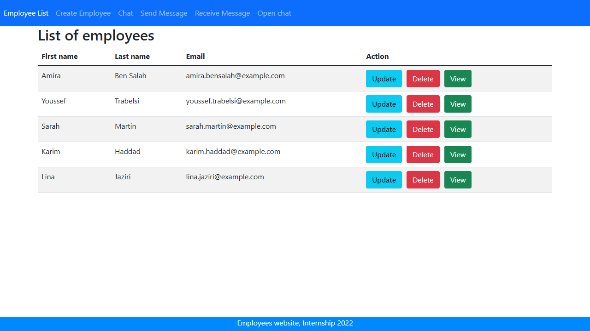
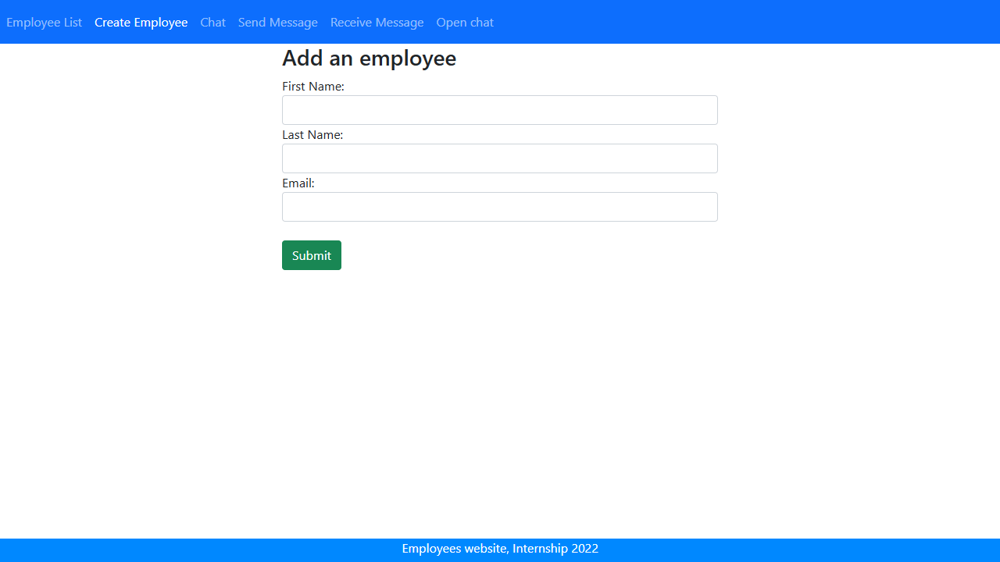
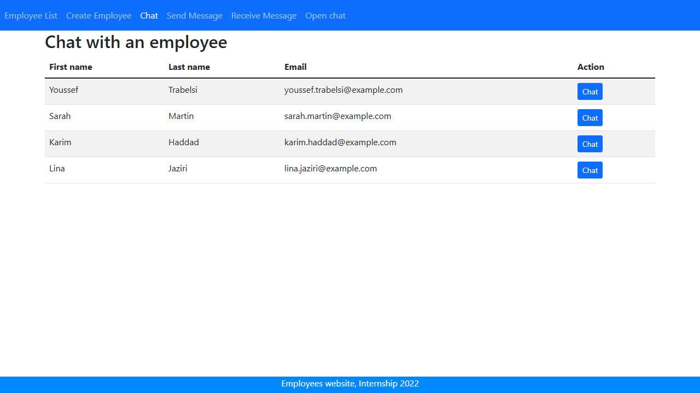
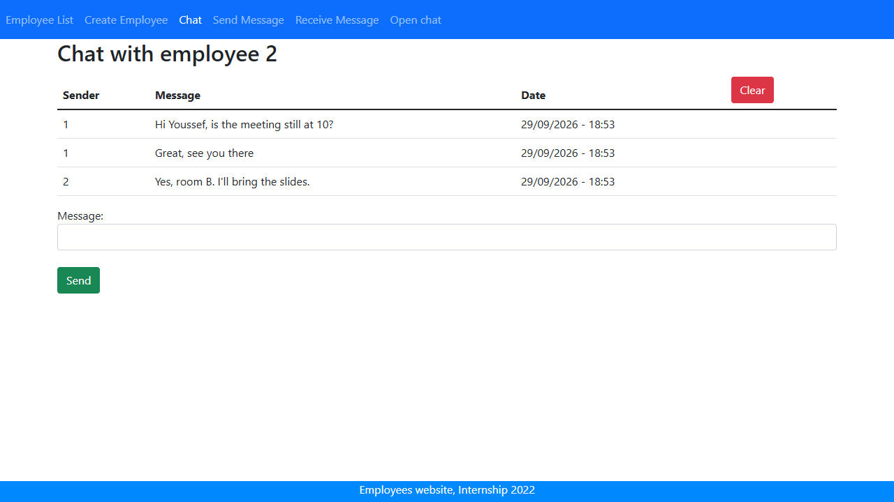

# StaffMessenger

Employee management with a built-in chat: staff are managed in a web app, and employees can message each other through RabbitMQ.

Built in 2022 during a summer internship at Spark-It.

## Screenshots

| Employee list | Add an employee |
|:---:|:---:|
|  |  |

| Chat: pick a colleague | Chat conversation |
|:---:|:---:|
|  |  |

## Repository structure

| Folder | Description | Stack |
|---|---|---|
| [`backend/`](backend/) | REST API for employees and messages | Java 17, Spring Boot 2.7, Spring Data JPA, MySQL, RabbitMQ |
| [`frontend/`](frontend/) | Employee management and chat pages | Angular 14, Bootstrap 5 |
| [`database/`](database/) | Sample employees for the demo | MySQL |

Each app has its own README with details: [backend](backend/README.md), [frontend](frontend/README.md).

## How it works

```
Browser ──▶ nginx ──▶ /api/v1/employees ──▶ backend ──▶ MySQL (employees)
                     /api/v1/employees/message │
                                               ├──▶ RabbitMQ exchange "spring-boot-exchange"
                                               │        └──▶ queue "spring-boot"
                                               └──◀ listener keeps received messages in memory
```

1. An employee sends a message: the backend publishes it to a RabbitMQ topic exchange.
2. A listener on the bound queue receives it and adds it to the inbox.
3. The chat page polls the inbox and shows the conversation.

## Run with Docker

```bash
docker compose up --build
```

This starts MySQL, RabbitMQ, the backend and the frontend. The Angular app is compiled and served by nginx, which also forwards `/api/` to the Spring Boot backend. The setup is meant for local use: MySQL has an empty root password and RabbitMQ uses the default `guest` account.

| Service | URL |
|---|---|
| App (nginx) | http://localhost:4200 |
| Backend API (direct) | http://localhost:8080/api/v1/employees |
| RabbitMQ management | http://localhost:15672 (user `guest`, password `guest`) |
| phpMyAdmin | http://localhost:8081 |
| MySQL | localhost:3306 (user `root`, empty password) |

On first start, MySQL loads 5 fictional employees from `database/seed.sql`. To reset, run `docker compose down -v` then `docker compose up`.

To try the chat, open **Chat**, pick who you are, then pick a colleague and send a message.

## Run without Docker

1. Start MySQL on port 3306 and RabbitMQ on port 5672 (default `guest` user).
2. Backend: `cd backend` then `./mvnw spring-boot:run` (port 8080)
3. Frontend: `cd frontend`, `npm install`, then `ng serve` (port 4200)

## Known limitations

This was a short internship project and the chat is a prototype:

- Messages are kept in the backend's memory, so they are lost on restart.
- Every chat shows the same shared inbox; messages are not filtered by conversation.
- There is no authentication: "logging in" just means picking an employee.
- The chat page polls the API every 250 ms instead of using WebSockets.
